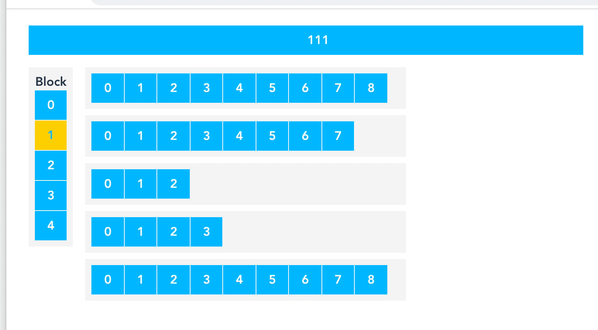

# Keyboard Navigator
## Work In Progress
It was developed as part of experiment of porting Videoload application to new stack with VueJS (take a look [here (YouTube)](https://www.youtube.com/watch?v=L8BspmBiSlk))

## Project setup
1. Install `vue-cli` if you don't have it:
```
npm install -g @vue/cli
```
2. Run `vue ui` in the console
3. Import folder to the **Vue Project Manager**
4. Run task `serve`
5. Open http://localhost:8080/


